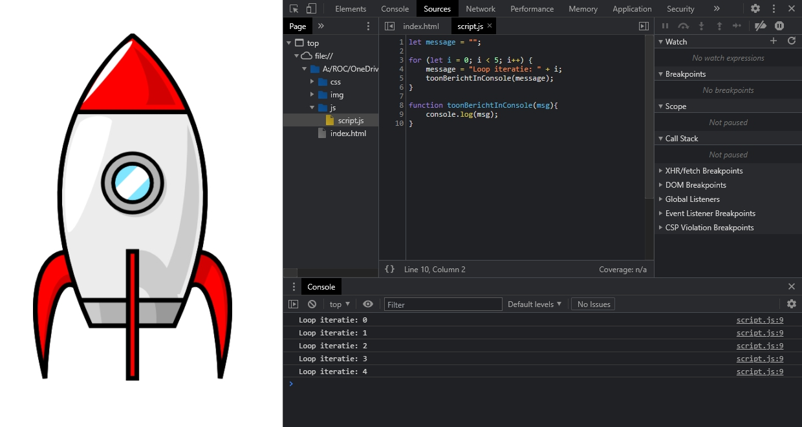

# DEBUGGING

## Chrome Devtools openen en javascript bestanden tonen

### Uitleg

Als Software Developer zal je vaak te maken krijgen met andermans code. Het is dan zaak om zo snel mogelijk inzicht te krijgen in de werking daarvan zodat je efficient werkt om bijvoorbeeld bugs op te lossen of features toe te voegen. 

Tot nu toe hebben we gewerkt met `console.log` statements. Daarmee kun je snel een waarde tonen in de console. 

Er zijn meer tools die je kunt inzetten om te zien hoe je code wordt uitgevoerd en waar het fout gaat.

In deze taak gaan we kennis maken met het debuggen (fouten opsporen en oplossen) van javascript in de Devtools van de Google Chrome browser.

> :rocket: Firefox (en andere browsers) hebben vergelijkbare mogelijkheden maar in de basis werkt het debuggen hetzelfde. Je kunt ook debuggen binnen VS Code of andere IDE's. De basis concepten zijn ook daar hetzelfde.

Zie [VIDEO: LinkedIn Learning - Javascript Debugging - Introducing our friend, the debugger](https://www.linkedin.com/learning/learning-javascript-debugging-2/introducing-our-friend-the-debugger)  
Zie [VIDEO: LinkedIn Learning - Javascript Debugging - Important Jargon en concepts](https://www.linkedin.com/learning/learning-javascript-debugging-2/important-jargon-and-concepts)

### Breakpoints

Je kunt aangeven waar je code stopt en de debugger wordt gestart op twee manieren:  
1. Je opent het javascript bestand in devtools (Sources tabblad > navigeer naar het javascript bestand in de file explorer links) en plaatst een breakpoint door op een regelnummer te klikken. Klik nogmaals om de breakpoint weer te verwijderen.
2. Je voegt een debugger statement toe op een specifeke regel van je code. Deze moet je dan weer weghalen op het moment dat de bug is opgelost. De debugger in devtools start pas als je devtools open hebt staan.

> :rocket: Als je code eenmaal is gestopt met uitvoeren kun je met <kbd>F5</kbd> de uitvoeren weer verder laten gaan. De debugger voert de code dan weer helemaal uit tot het einde van het programma of stopt als er weer een debugger statement in de code of een breakpoint wordt tegengekomen.

Zie [VIDEO: LinkedIn Learning - Javascript Debugging - Simpel Breakpoints](https://www.linkedin.com/learning/learning-javascript-debugging-2/stop-and-look-around-simple-breakpoints)

### Step-into, step-over, step-out

Als de debugger een debugger statement of een breakpoint tegenkomt dan stopt de uitvoering van je programma op die regel. De regel code die is gehighlight is dan _nog niet_ uitgevoerd. Je gebruikt een van de onderstaande drie opties om de regel code uit te voeren en automatisch te stoppen op een volgende regel code.

1. Step-into: <kbd>F11</kbd> in Chrome devtools. Je stapt hiermee regel voor regel door je code. Als er bv een functie wordt aangeroepen dan stap je _in_ die functie en stopt de uitvoering op de eerste regel van de code van die functie. Op deze manier stap echt regel voor regel door alle code die wordt uitgevoerd in je programma.

2. Step-over: <kbd>F10</kbd> Hiermee sla je de code van een functie _over_.

3. Step-out: <kbd>SHIFT</kbd>+<kbd>F11</kbd> Je stapt hiermee _uit_ een functie als je eenmaal in de functie code zit.

Zie [VIDEO: LinkedIn Learning - Javascript Debugging - Step into, over, and out of functions](https://www.linkedin.com/learning/learning-javascript-debugging-2/step-into-over-and-out-of-functions)

### Leerdoelen

1. Ik kan een javascript bestand openen in devtools
2. Ik kan een breakpoint toevoegen aan code via een `debugger;` statement of de devtools interface
3. Ik kan stap voor stap mijn code uitvoeren door step-into, step-over en step-out te gebruiken
4. Bekijk de gelinkte videos

### Opdracht

> ### Inleveren in canvas
> :warning: Voer onderstaande opdrachten uit en lever in Canvas een link in bij deze opdracht naar het `js/script.js` bestand op github.

1. Open de `index.html` in Chrome en open de Devtools via het rechtermuisknop menu > Inspect of de sneltoets <kbd>CTRL</kbd>+<kbd>SHIFT</kbd>+<kbd>i</kbd>
2. Klik op het `Sources` tabblad en navigeer naar `script.js` in de `js` map.
3. Stel je Devtools venster zo in dat je de verschillende vensters ziet als je javascript gaat debuggen.
4. Zet een breakpoint op een regel in de code, refresh je browservenster en loop regel voor regel door de code tot het programma volledig is uitgevoerd.

### Eindresultaat

Devtools met alle vensters open die je nodig hebt om te debuggen open:

### Bronnen
https://www.linkedin.com/learning/learning-javascript-debugging-2/introducing-our-friend-the-debugger
https://www.linkedin.com/learning/learning-javascript-debugging-2/important-jargon-and-concepts
https://www.linkedin.com/learning/learning-javascript-debugging-2/stop-and-look-around-simple-breakpoints
https://www.linkedin.com/learning/learning-javascript-debugging-2/step-into-over-and-out-of-functions